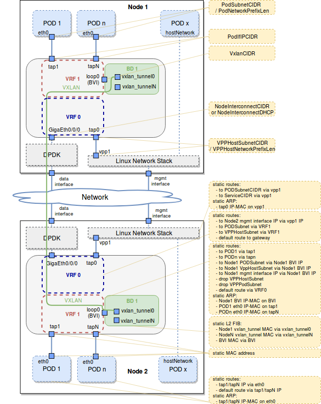

# Contiv/VPP Network Operation

This document describes the network operation of the Contiv/VPP k8s network plugin. It
elaborates the operation and config options of the Contiv IPAM, as well as 
details on how the VPP gets programmed by Contiv/VPP control plane.

The following picture shows 2-node k8s deployment of Contiv/VPP, with a VXLAN tunnel
established between the nodes to forward inter-node POD traffic. The IPAM options
are depicted on the Node 1, whereas the VPP programming is depicted on the Node 2.

## Contiv IPAM (IP Address Management)

IPAM in Contiv is based on the concept of **Node ID**. The Node ID is a number
that uniquely identifies a node in the k8s cluster. The first node is assigned
the ID of 1, the second node 2, etc. If a node leaves the cluster, its 
ID is released back to the pool and will be re-used by the next node.

The Node ID is used to calculate per-node IP subnets for PODs
and other internal subnets that need to be unique on each node. Apart from Node ID,
the input for IPAM calculations is a set of config knobs, which can be specified
in the `IPAMConfig` section of the [Contiv/VPP deployment YAML](../k8s/contiv-vpp.yaml):

- **PodSubnetCIDR** (default `10.1.0.0/16`): each pod gets an IP address assigned 
from this range. The size of this range (default `/16`) dictates upper limit of 
POD count for the entire k8s cluster (default 65536 PODs).

- **PodNetworkPrefixLen** (default `24`): per-node dedicated podSubnet range. 
From the allocatable range defined in `PodSubnetCIDR`, this value will dictate the 
allocation for each node. With the default value (`24`) this indicates that each node 
has a `/24` slice of the `PodSubnetCIDR`. The Node ID is used to address the node. 
In case of `PodSubnetCIDR = 10.1.0.0/16`, `PodNetworkPrefixLen = 24` and `NodeID = 5`,
the resulting POD subnet for the node would be `10.1.5.0/24`.

- **PodIfIPCIDR** (default `10.2.1.0/24`): VPP-internal addresses used to put
the VPP interfaces facing towards the PODs into L3 mode. This IP range will be reused 
on each node, thereby it is never externally addressable outside of the node itself.
The only requirement is that this subnet should not collide with any other IPAM subnet.

- **VPPHostSubnetCIDR** (default `172.30.0.0/16`): used for addressing 
the interconnect of the VPP with the Linux network stack within the same node. 
Since this subnet needs to  be unique on each node, Node ID is used to determine 
the actual subnet used on the node with the combination of `VPPHostNetworkPrefixLen`, 
similarly as for the `PodSubnetCIDR` and `PodNetworkPrefixLen`.

- **VPPHostNetworkPrefixLen** (default `24`): used to calculate the subnet 
for addressing the interconnect of VPP with the Linux network stack within the same node.
With `VPPHostSubnetCIDR = 172.30.0.0/16`, `VPPHostNetworkPrefixLen = 24` and
`NodeID = 5` the resulting subnet for the node would be `172.30.5.0/24`.

- **NodeInterconnectCIDR** (default `192.168.16.0/24`): range for the addresses 
assigned to the data plane interfaces managed by VPP. Unless DHCP is used 
(`NodeInterconnectDHCP = True`), Contiv control plane automatically assigns
an IP address from this range to the DPDK-managed ethernet interface bound to VPP 
on each node. The actual IP address will be calculated from the Node ID, e.g. with 
`NodeInterconnectCIDR = 192.168.16.0/24` and `NodeID = 5` the resulting IP
address assigned to ethernet interface on VPP will be `192.168.16.5`.

- **NodeInterconnectDHCP** (default `False`): instead of assigning the IPs
for data plane interfaces managed by VPP from the `NodeInterconnectCIDR` by Contiv
control plane, use DHCP that must be running in the network where the data
plane interface is connected to. In case that `NodeInterconnectDHCP = True`,
`NodeInterconnectCIDR` is ignored.

- **VxlanCIDR** (default `192.168.30.0/24`): in order to provide inter-node
POD to POD connectivity via any underlay network (not necessarily a L2 network),
Contiv/VPP sets up VXLAN tunnel overlay between each 2 nodes within the cluster. For this purpose,
each node needs its unique IP address of the VXLAN BVI interface. This IP address
is automatically calculated from the Node ID, e.g. with `VxlanCIDR = 192.168.30.0/24`
and `NodeID = 5` the resulting IP address assigned to VXLAN BVI 
interface will be `192.168.30.5`.

## VPP Programming
This section describes how Contiv/VPP control plane programs VPP based on the
events it receives from k8s. It is not necessarily needed to understand this
for basic operation of Contiv/VPP, but it can be very useful for debugging purposes.

Contiv/VPP currently uses a single VRF to forward the traffic between PODs on a node,
PODs on different nodes, host network stack and DPDK-managed dataplane interface. The forwarding
between each of them is purely L3-based, even for case of the communication
between 2 PODs within the same node, which seem to be on a single subnet.

#### DPDK-managed data interface
TODO

#### Linux host network stack
TODO

#### PODs on the same node
TODO

#### PODs with hostNetwork=true
TODO

#### VXLANs to other nodes
TODO

#### More info
Please refer to the [Packet Flow Dev Guide](dev-guide/PACKET_FLOW.md) for more 
detailed description of paths traversed by request and response packets 
inside Contiv/VPP Kubernetes cluster  under different situations.