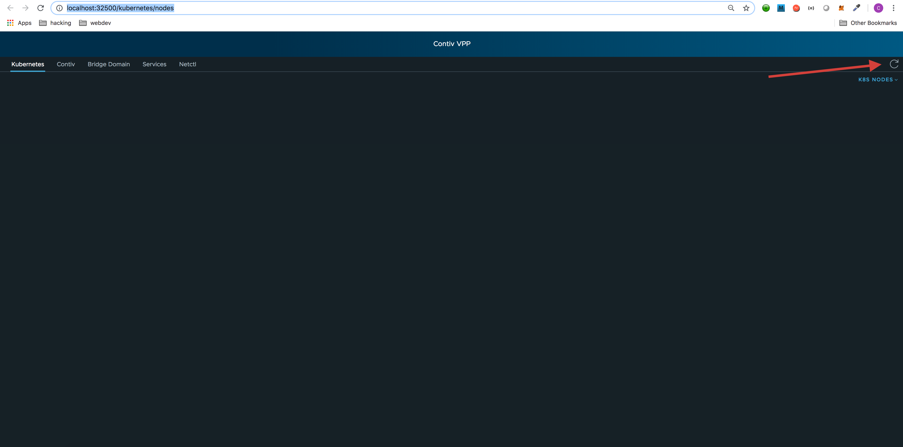
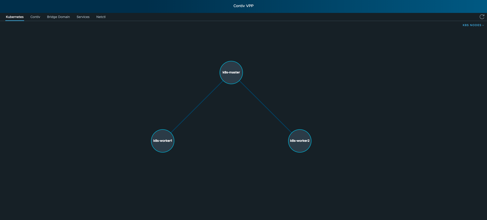
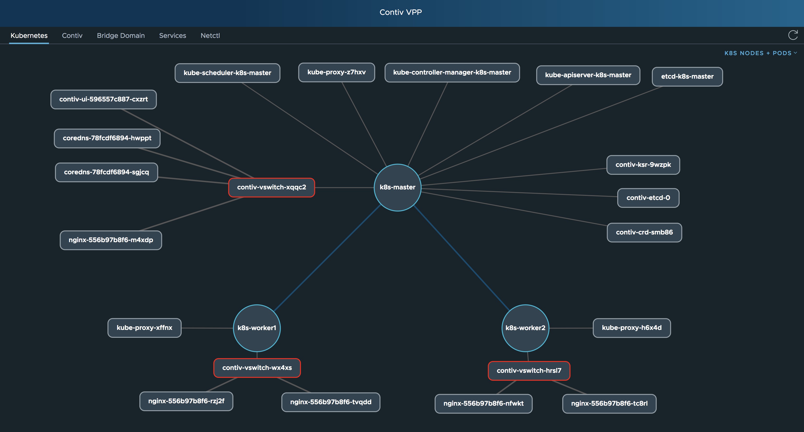
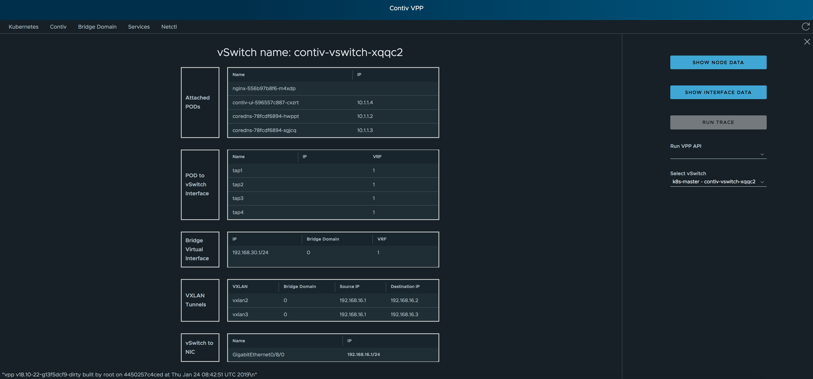

# Contiv VPP UI

Project page: https://contivpp.io/

This project was generated with [Angular CLI](https://github.com/angular/angular-cli) version 7.0.2.

## Start App

### Prerequisities

- Google Chrome - running with [disabled web security](https://stackoverflow.com/questions/3102819/disable-same-origin-policy-in-chrome) (Important for accessing the APIs).
    ##### -Command in OSX:
    Open -n -a "Google Chrome" --args --disable-web-security --user-data-dir=/tmp/chrome http://localhost:32500
    ##### -Command in Windows:
    In the "Run" app, enter: chrome.exe --user-data-dir="C://Chrome dev session" --disable-web-security http://localhost:32500
    ##### -Command in Linux:
    google-chrome --user-data-dir="/var/tmp/Chrome" --disable-web-security "http://localhost:32500"
- Vagrant
- VirtualBox
- Laptop w/ 16GB of memory
- Only runs on a laptop at this time. It does not support nor can it be deployed on a remote server.
- [Postman](https://www.getpostman.com/) to look over [APIs](https://github.com/ligato/vpp-agent/tree/dev/plugins/restv2)

### Running

Shutdown all extraneous apps. You need as much memory as possible on your laptop to run the k8s cluster.

1. clone this repository (`git clone https://github.com/contiv/vpp.git`)
2. change directory to vpp (`cd vpp`)
3. checkout kubecon2018 branch (`git checkout kubecon2018`). 
4. cd into vpp/ui directory (`cd ui`)
5. from this directory run one of these commands:
- `./start.sh` for fully automated setup - run 2 workers in production enviroment without STN

You should then see this:

	CHMETZ-M-72TZ:vpp chrismetz$ cd ui
	CHMETZ-M-72TZ:ui chrismetz$ ./start.sh
	Starting Contiv VPP ...

	Creating a production environment, without STN and 2 worker nodes

	Creating VirtualBox DHCP server...
	Bringing machine 'k8s-gateway' up with 'virtualbox' provider...
	Bringing machine 'k8s-master' up with 'virtualbox' provider...
	Bringing machine 'k8s-worker1' up with 'virtualbox' provider...
	Bringing machine 'k8s-worker2' up with 'virtualbox' provider...
	==> k8s-gateway: Cloning VM...
	etc ... etc ...

Get a cup of coffee. It will be a few minutes. 

When you return, this message indicates the UI is ready.

	For accessing k8s nodes via 'vagrant ssh', cd into vpp/vagrant directory.

	Application has been deployed on http://localhost:32500 

When everything is deployed, navigate to `http://localhost:32500/` on Chrome with disabled web security - it should be automatically open if installed. If for some reason it does not automatically open, go to the CLI and type in one of the disable web security commands. This is the one for a mac:

	Open -n -a "Google Chrome" --args --disable-web-security --user-data-dir=/tmp/chrome http://localhost:32500

What you will see next is the UI with no topology. We need to wait a few moments (could be a couple of minutes) until k8s has completed its work and all systems are ready to go. 

Hit the refresh button at the red arrow to have the UI query the system for a topology. In fact you should hit the refresh button any time the topology has changed.

Once the UI can successfully query the system for the topology/etc. you will be greated with the initial 3 - node demo topology as shown.

### Accessing APIs

#### Postman collection
[Collection](./data/ContivVPP.postman_collection.json)

### Use 'vagrant ssh' to control nodes
After successful build, you can access created Kubernetes nodes CLI.

1. cd into vpp/vagrant (`cd /vpp/vagrant`)
2. from this directory run one of these commands:
- `vagrant ssh k8s-master` for accessing k8s-master node
- `vagrant ssh k8s-worker1` for accessing k8s-worker1 node
- `vagrant ssh k8s-worker2` for accessing k8s-worker2 node

For more details click [here](https://github.com/contiv/vpp/tree/kubecon2018/vagrant).

### Deploying pods/services

For deploying nginx pods/services [log into k8s-master node](#use-vagrant-ssh-to-control-nodes) and change directory to /vagrant (`cd /vagrant`).
All of these things can be also done via UI's Netctl terminal (no need to change directory).

#### nginx
From `/vagrant` directory run `./nginx-add` for adding nginx pods and services. To verify that everything is correctly deployed, run `kubectl get pods` and `kubectl get svc` in order to verify currently loaded application pods and services. If you want to remove nginx pods and services, you can run `./nginx-delete`.

#### busybox
- `cd /vagrant` in k8s-master
- `./busybox-add` for adding busyboxes
- `./busybox-delete` for deleting busyboxes

#### Testing nginx
Be sure that [nginx services](#nginx) are deployed.

- `cd /vagrant` in k8s-master

1. create testing busyboxes: `python create-client.py`
2. run test script: `python servrun.py` - you can see the cluster switching between different nginx IPs.
3. now you can delete testing busyboxes: `delete-client.py`

### Shutdown App
When you finished the work with the application, run `./stop.sh` from `vpp/ui` folder - this will shutdown all Vagrant instances.

### Wiping all data/settings

Run `./clear.sh` from vpp/ui directory for clearing all data and settings (destroy each Vagrant instance). After this command you need to follow [running steps](#running) from the 3rd point and build application again.

## Contivpp UI Screenshots Using the Demo App Cluster

View of 3 x node K8s cluster topology. Note the presence of contiv vSwitches in each node.

Assigned IP addresses and interfaces

Logical vxlan network overlay established by established by contivpp.io

Pods in the cluser belonging to a K8s service

